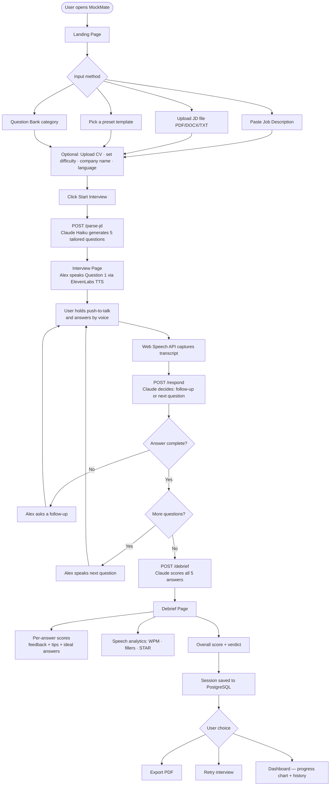

# MockMate — AI Voice Interview Simulator

Practice job interviews with a human-sounding AI interviewer. Paste a job description (or upload it as a file), answer 5 questions by voice, and receive a fully scored debrief with speech analytics. Your sessions and CV are saved to a personal dashboard.

**Live Demo:** https://mockmate-1-hmpj.onrender.com/

---

## How It Works



---

## Features

### Interview
- Paste or upload a job description (PDF, DOCX, TXT) — auto-fills the JD field
- 5 tailored questions generated by Claude Haiku — personalised when a CV is provided
- **ElevenLabs AI voice** for the interviewer (Daniel — professional male, `eleven_multilingual_v2`)
- Push-to-talk recording via Web Speech API (spacebar or button)
- Smart follow-up questions when answers are too short
- Difficulty levels: **Junior / Mid / Senior**
- Interview types: **Full · Behavioral · Technical · Screening**
- Question bank mode (System Design, React, Python, SQL, Leadership, and more)
- Language support: **English · German · French**

### Debrief
- Per-answer score (0–10), feedback, actionable tip, and model ideal answer
- Speech analytics: WPM, filler word count, STAR framework detection
- Overall score, performance verdict, and improvement summary
- PDF export of the full debrief

### Dashboard
- Session history with per-session drill-down (scores, STAR breakdown, speech stats)
- Progress chart — score over time across all interviews
- Filter sessions by difficulty level

### CV Profile
- Upload your CV once (PDF, DOCX, TXT) — AI parses it into sections
- Sections displayed: Profile summary · Skills · Experience · Education · Languages · Certifications
- CV saved per user and reused across sessions
- Re-upload any time to update

---

## Tech Stack

| Layer | Technology |
|-------|-----------|
| Frontend | React + Tailwind CSS (Vite) |
| Backend | FastAPI (Python) |
| LLM | Claude Haiku via OpenRouter |
| STT | Web Speech API — browser built-in, free |
| TTS | **ElevenLabs** — Daniel voice, `eleven_multilingual_v2` |
| Database | PostgreSQL (sessions, CV profiles) |
| Containerisation | Docker + Docker Compose |

---

## Quick Start (Docker)

The fastest way to run MockMate locally — requires [Docker Desktop](https://www.docker.com/products/docker-desktop/).

```bash
git clone https://github.com/omairtemurian/MockMate.git
cd MockMate

# 1. Create your .env file from the template
cp .env.template .env
# Edit .env — add OPENROUTER_API_KEY and VITE_ELEVENLABS_API_KEY

# 2. Build and start all three services (postgres + backend + frontend)
docker compose up --build
```

Open **http://localhost:3000** in Chrome.

> If you change an API key, re-run `docker compose up --build` because `VITE_ELEVENLABS_API_KEY` is baked into the frontend build.

---

## Manual Local Setup

### Prerequisites
- Python 3.10+
- Node 18+
- PostgreSQL (or use Docker just for the database: `docker run -e POSTGRES_PASSWORD=postgres -p 5432:5432 postgres:16-alpine`)

### Backend

```bash
cd backend
pip install -r requirements.txt
# Create backend/.env with the variables listed below
uvicorn main:app --reload
```

### Frontend

```bash
cd frontend
npm install
# Create frontend/.env with the variables listed below
npm run dev
```

Open **http://localhost:5173** in Chrome (Web Speech API requires Chrome).

> **Windows shortcut:** double-click `Start MockMate.bat` to launch both servers at once.

---

## Environment Variables

| Variable | File | Description |
|----------|------|-------------|
| `OPENROUTER_API_KEY` | `backend/.env` | LLM API key — get one at [openrouter.ai/keys](https://openrouter.ai/keys) |
| `DATABASE_URL` | `backend/.env` | PostgreSQL connection string (defaults to `localhost:5432/mockmate`) |
| `VITE_BACKEND_URL` | `frontend/.env` | Backend URL (`http://localhost:8000` locally) |
| `VITE_ELEVENLABS_API_KEY` | `frontend/.env` | ElevenLabs key — get one at [elevenlabs.io](https://elevenlabs.io) (10k chars/month free) |

Never commit `.env` files — they are in `.gitignore`. Use `.env.template` as a reference.

---

## Deploy (Render)

All three services deploy to Render's free tier.

**1 — PostgreSQL database**
- New → PostgreSQL → Free plan → name it `mockmate-db`
- Copy the **Internal Database URL**

**2 — Backend (Web Service)**
- Root directory: `backend`
- Build command: `pip install -r requirements.txt`
- Start command: `uvicorn main:app --host 0.0.0.0 --port $PORT`
- Environment variables: `OPENROUTER_API_KEY`, `DATABASE_URL` (paste Internal URL from step 1)

**3 — Frontend (Static Site)**
- Root directory: `frontend`
- Build command: `npm install && npm run build`
- Publish directory: `dist`
- Environment variables: `VITE_BACKEND_URL` (your backend Render URL), `VITE_ELEVENLABS_API_KEY`

---

## Cost

| Component | Cost |
|-----------|------|
| Claude Haiku (LLM) | ~$0.001–0.003 per interview |
| ElevenLabs TTS | Free up to 10,000 chars/month; ~$5/month after |
| Web Speech API (STT) | Free — browser built-in |
| Render hosting | Free tier available |

---

## Contributors

| GitHub | Profile |
|--------|---------|
| omairtemurian | [@omairtemurian](https://github.com/omairtemurian) |
| romanandreyev-gif | [@romanandreyev-gif](https://github.com/romanandreyev-gif) |
| VolodymyrSalenko | [@VolodymyrSalenko](https://github.com/VolodymyrSalenko) |
| olha-mytrofanova | [@olha-mytrofanova](https://github.com/olha-mytrofanova) |
