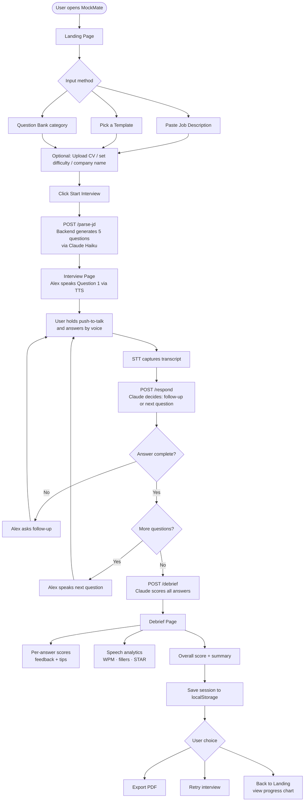

# MockMate — AI Voice Interview Simulator

Practice job interviews with an AI voice interviewer. Paste a job description, answer 5 questions by voice, and receive a fully scored debrief.

**Live Demo:** https://mockmate-1-hmpj.onrender.com/

## How It Works



## What It Does

1. User pastes a job description (or picks a preset template / question bank category)
2. Backend generates 5 tailored interview questions (2 behavioral, 2 technical, 1 motivation)
3. AI interviewer "Alex" speaks questions aloud using the browser's built-in SpeechSynthesis API
4. User answers by voice using push-to-talk (button or spacebar)
5. Speech-to-text via Web Speech API (browser built-in, free)
6. Claude Haiku responds as the interviewer with follow-up questions or moves to the next question
7. Final debrief shows per-answer scores, feedback, tips, speech analytics, and an overall summary

## Features

- CV/Resume upload (PDF, DOCX, TXT) for personalized questions
- Difficulty levels: Junior / Mid / Senior
- Interview types: Full, Behavioral only, Technical only, Screening call
- Question bank mode (System Design, React, Python, SQL, Leadership, and more)
- Real-time speech analytics: WPM, filler word detection, STAR framework tracking
- PDF export of debrief results
- Session history with progress chart (localStorage)

## Tech Stack

| Layer | Technology |
|-------|-----------|
| Frontend | React + Tailwind CSS (Vite) |
| Backend | FastAPI (Python) |
| LLM | Claude Haiku via OpenRouter |
| STT | Web Speech API — browser built-in, **free** |
| TTS | SpeechSynthesis API — browser built-in, **free** |
| State | In-memory + localStorage (no database) |
| Auth | None |

## Setup

### Backend

```bash
cd backend
pip install -r requirements.txt
cp .env.example .env
# Edit .env and set your OPENROUTER_API_KEY
```

### Frontend

```bash
cd frontend
npm install
cp .env.example .env
# Edit .env — set VITE_BACKEND_URL=http://localhost:8000
```

## Run Locally

**Terminal 1 — Backend:**
```bash
cd backend
uvicorn main:app --reload
```

**Terminal 2 — Frontend:**
```bash
cd frontend
npm run dev
```

Open `http://localhost:5173` in Chrome (Web Speech API requires Chrome).

> **Windows shortcut:** double-click `Start MockMate.bat` to launch both servers at once.

## Environment Variables

| Variable | Where | Description |
|----------|-------|-------------|
| `OPENROUTER_API_KEY` | `backend/.env` | Your OpenRouter API key |
| `VITE_BACKEND_URL` | `frontend/.env` | Backend URL (`http://localhost:8000` locally, or your deployed URL) |

Never commit `.env` files — they are in `.gitignore`.

## Deploy

**Backend → Render (free tier)**
- Service type: Web Service
- Build command: `pip install -r requirements.txt`
- Start command: `uvicorn main:app --host 0.0.0.0 --port $PORT`
- Add env var: `OPENROUTER_API_KEY`

**Frontend → Vercel (free tier)**
- Framework: Vite
- Root directory: `frontend`
- Add env var: `VITE_BACKEND_URL=https://your-render-service.onrender.com`

## Cost

- **$0** — STT, TTS, and state management use free browser APIs
- **~$0.001–0.003 per interview** — Claude Haiku only, with history trimming to last 6 messages

## Contributors

| GitHub | Profile |
|--------|---------|
| omairtemurian | [@omairtemurian](https://github.com/omairtemurian) |
| romanandreyev-gif | [@romanandreyev-gif](https://github.com/romanandreyev-gif) |
| VolodymyrSalenko | [@VolodymyrSalenko](https://github.com/VolodymyrSalenko) |
| olha-mytrofanova | [@olha-mytrofanova](https://github.com/olha-mytrofanova) |
